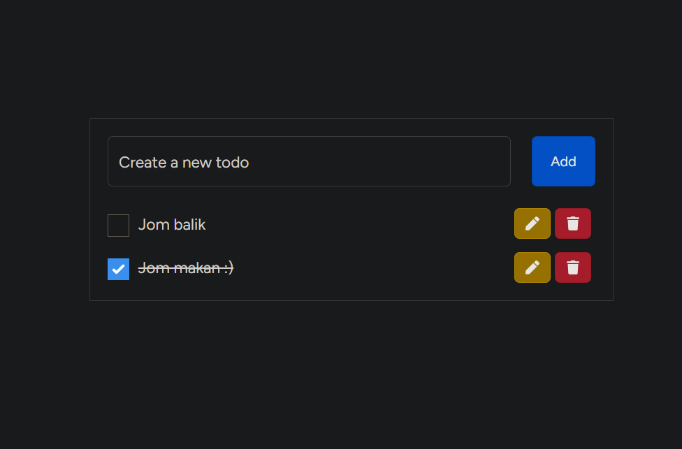

# A Laravel and React Project
 Creating a todolist as a practice for Laravel and React

## Table of contents

- [Overview](#overview)
  - [Screenshot](#screenshot)
- [My process](#my-process)
  - [Built with](#built-with)
  - [What I learned](#what-i-learned)
- [Author](#author)

## Overview

### Screenshot

## My process

### Built with

- Laravel Starter Kit with Breeze and Reactjs

### What I learned

- CRUD in Laravel
- Eloquent Model in Laravel

### Continued development

- To create a toggle checked state that can be stored inside the table which later on be used to apply strikethrough the the todo entry 

## Author

- GitHub - [Nur Aina Balqis Binti Mohamad Rosidek](https://github.com/nabbysidek)